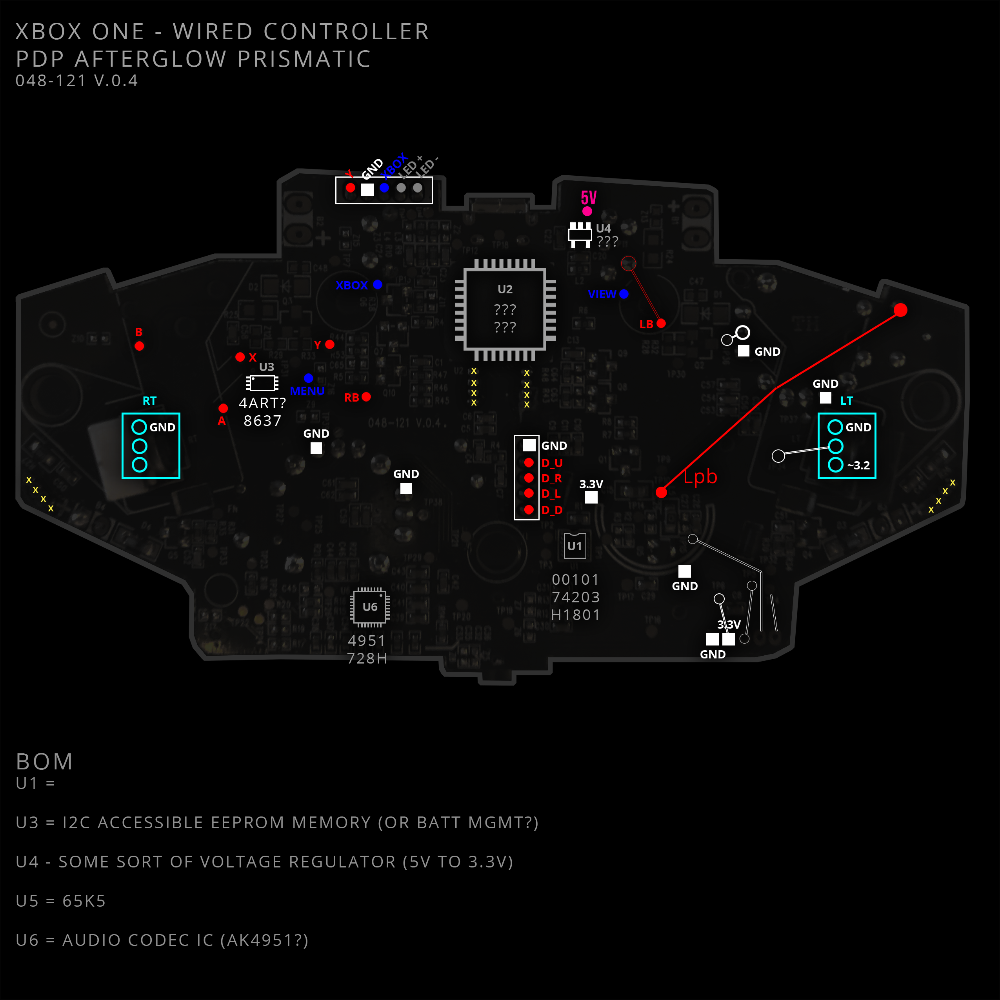

**XCV**
===========
🕹 XCV uses 👾OpenCV for 🐍Python to 👷‍operate a ✨magic 🤖robot 🎮controller

----

**The project's goal is to make game-based OpenCV experiments easier.**

By avoiding controller-driver nonsense and just hacking into controllers and connecting the buttons to an arduino/teensy/whatever. On the arduino/teensy side of things, we then just parse out the commands and send some high/low signals to I/O pins (other bits and bobs to handle all the I/O) and then a fancy display output to make things more fancy.

-----------------------

.. image:: https://img.shields.io/travis/boo13/xcv.svg
   :target: https://img.shields.io/travis/boo13/xcv.svg
   :alt: Travis
 
.. image:: https://readthedocs.org/projects/xcv/badge/?version=latest
   :target: https://xcv.readthedocs.io
   :alt: Read the Docs
 
.. image:: https://img.shields.io/github/license/boo13/xcv
   :target: https://github.com/boo13/xcv/blob/master/LICENSE
   :alt: GitHub
    
.. image:: https://img.shields.io/github/repo-size/boo13/xcv
   :alt: GitHub repo size

:Authors: 👻
:Version: 0.1.0
:Documentation: https://xcv.readthedocs.io
:History: HISTORY.rst_

.. _HISTORY.rst: https://github.com/boo13/xcv/blob/master/HISTORY.rst

----

Project Mission
=================
**To create a gaming controller (in my case an Xbox One controller) that can  take commands OpenCV - without dealing with windows drivers or any of that stuff that's over my head.**

* **CLI Commands to Xbox** - **MOSTLY DONE (save for a few bugs)** - Ability to send individual commands to a hacked Xbox controller via the command line. 

* **GUI Commands to Xbox** - Ability to send individual commands to a hacked Xbox controller via graphical user interface (built using `PySimpleGuiQt`. 

* **Navigate Menus** - **MOSTLY DONE (save for a few edge cases)** - his requires OpenCV to identify the Game-State (e.g. in Main Menu) and Menu Selection (e.g. on "Play Now" button). 

* **Accurately Track Game State** - I define "Game State" as essnetially anything that is loaded as a new game mode (e.g. In-Game Menu, Main-Menu, Squad Management Screen, etc.). If the game pauses for a moment to load a screen, I basically call that a Game State. This means that I define "Loading Ultimate Team" as a unique Game State from "Loading Game" or even "Loading Pre-Game Stats"

* **Accurately Track Game Stats** - Examples include: Win/Loss rate, Game Score, Game Time, Game Real-Time Length, etc. 

What does XCV do?
=================

.. image:: blog/images/history/2019_07_28.21.53.45.png

.. image:: blog/images/sampleImage.png
  :width: 400pt

In-Game Tracking
================
+----------------------------------------------------------------+------------------------------------+--------------------------------------------------------------------------------------------------------------------------------------------------------------------------------------------------------+----------------+-----+
| Template Image                                                 | Template Name                      | Usage                                                                                                                                                                                                  | Size           | ROI |
+================================================================+====================================+========================================================================================================================================================================================================+================+=====+
| .. image:: templates/myTeamBadge.jpg                           | **My Team Badge**                  | Determine which side of the game sreen I am defending                                                                                                                                                  | *24px X 24px*  |     |
+----------------------------------------------------------------+------------------------------------+--------------------------------------------------------------------------------------------------------------------------------------------------------------------------------------------------------+----------------+-----+
| .. image:: templates/myTeamScoreboardName.png                  | **My Team Scoreboard Name**        | Determine which side of the scoreboard we're on, ``Game.HomeTeam`` or ``Game.AwayTeam`` And is currently the first indication that we are ``GameState.InGame``                                         | *25px X 8px*   |     |
+----------------------------------------------------------------+------------------------------------+--------------------------------------------------------------------------------------------------------------------------------------------------------------------------------------------------------+----------------+-----+
| .. image:: templates/HomeScore/0.png                           | **Home Score**                     | Digits 0-11 currently used, matched via template matching with moderate success                                                                                                                        | *25px X 8px*   |     |
+----------------------------------------------------------------+------------------------------------+--------------------------------------------------------------------------------------------------------------------------------------------------------------------------------------------------------+----------------+-----+
| .. image:: templates/HomeScore/0.png                           | **Away Score**                     | Digits 0-1 currently used, matched via template matching with not-so-great success                                                                                                                     | *25px X 8px*   |     |
+----------------------------------------------------------------+------------------------------------+--------------------------------------------------------------------------------------------------------------------------------------------------------------------------------------------------------+----------------+-----+

.. image:: blog/images/screenshot_SinglePlayerMenu.png
  :width: 400pt

Menu Tracking
=============
+----------------------------------------------------------------+------------------------------------+--------------------------------------------------------------------------------------------------------------------------------------------------------------------------------------------------------------------------------------------------------------------------------------------+----------------+-----+
| Template Image                                                 | Template Name                      | Usage                                                                                                                                                                                                                                                                                      | Size           | ROI |
+================================================================+====================================+============================================================================================================================================================================================================================================================================================+================+=====+
| .. image:: templates/SquadManagement.png                       | **Squad Management Menu**          | Indicates the Squad Management Screen                                                                                                                                                                                                                                                      | *22px X 13px*  |     |
+----------------------------------------------------------------+------------------------------------+--------------------------------------------------------------------------------------------------------------------------------------------------------------------------------------------------------------------------------------------------------------------------------------------+----------------+-----+
| .. image:: templates/Menu/InGameMenu_ResumeMatch_Off.png       | **In-Game Menu - OFF**             | Indicates the InGameMenu Screen. Also indicates if we are ``off`` the ``ResumeMatch`` button.                                                                                                                                                                                              | *30px X 30px*  |     |
+----------------------------------------------------------------+------------------------------------+--------------------------------------------------------------------------------------------------------------------------------------------------------------------------------------------------------------------------------------------------------------------------------------------+----------------+-----+
| .. image:: templates/Menu/InGameMenu_ResumeMatch_On.png        | **In-Game Menu - ON**              | Indicates the InGameMenu Screen. Also indicates if we are ``on`` the ``ResumeMatch`` button.                                                                                                                                                                                               | *30px X 30px*  |     |
+----------------------------------------------------------------+------------------------------------+--------------------------------------------------------------------------------------------------------------------------------------------------------------------------------------------------------------------------------------------------------------------------------------------+----------------+-----+
| .. image:: templates/45min.png                                 | **In-Game Menu - Half-Time**       | Matching this template indicates the InGameMenu Screen is at ``45.00``\ , it's not a perfect method for indicating if we are at Half-time (since pausing the game in stoppage time will send a false indication), but it's good-enough for now.                                            | *31px X 14px*  |     |
+----------------------------------------------------------------+------------------------------------+--------------------------------------------------------------------------------------------------------------------------------------------------------------------------------------------------------------------------------------------------------------------------------------------+----------------+-----+
| .. image:: templates/90min.png                                 | **In-Game Menu - Full-Time**       | Matching this template indicates the InGameMenu Screen is at ``90.00``\ , it's not perfect (see above.)                                                                                                                                                                                    | *31px X 14px*  |     |
+----------------------------------------------------------------+------------------------------------+--------------------------------------------------------------------------------------------------------------------------------------------------------------------------------------------------------------------------------------------------------------------------------------------+----------------+-----+
| .. image:: templates/StartBtn.png                              | **Pre-Game Start Menu**            | We see this screen in FUT>Single-Player Season>Pre-Game Menu. It is one of the rare instances that a menu screen requires pressing the ``Start`` button to continue. Matching this template indicates we are in ``GameState.PreGameStartMenu`` and we need to send ``xcontroller.Start``   | *128px X 27px* |     |
+----------------------------------------------------------------+------------------------------------+--------------------------------------------------------------------------------------------------------------------------------------------------------------------------------------------------------------------------------------------------------------------------------------------+----------------+-----+
| .. image:: templates/HomeMenu_Cart.png                         | **FUT Home Menu**                  | We use the little shopping-cart icon in the top-right corner of the screen as our Main Menu indicator. Matching this template image indicates we are in ``GameState.FUTMainMenu``                                                                                                          | *16px X 13px*  |     |
+----------------------------------------------------------------+------------------------------------+--------------------------------------------------------------------------------------------------------------------------------------------------------------------------------------------------------------------------------------------------------------------------------------------+----------------+-----+

Hardware
=============

Mira_CaptureCard_

I use this to send a videostream into OpenCV. It's not the greatest, I tried others that didn't work, this isn't an affiliate-link, so don't take my word for it. Originally, I used the python package `streamlink` to feed the data in via Twitch or Mixer(xbox's slightly-faster version of Twitch), but I found the lag time tough to work with as it created more oppurtunities for miscommunication and visual artifacting. I will probably, eventually, try and reimplement the ability to stream in the videos once I get some functions to handle timing of commands. That way, I'll just reduce the frequency of the command sends to something like once every 10 seconds. 

.. _Mira_CaptureCard: https://www.amazon.com/MiraBox-Loop-Out-Streaming-Recording-HSV321/dp/B07C6KCBYB

CLI
=============

``python3 xcv``

Options:
  -v, --verbose                        Display debug information
  --port TEXT                          Controller port, default is /dev/cu.SLAB_USBtoUART
  -auto, --autopilot                   Initiate xcv sequence
  --push                               Enter button to push (A, B, X, Y, S, l, r, w, a, s, d, o, p)
  --count INTEGER                      Time in seconds before commands
  -dry, --dryrun                       For testing without xbox controller connected
  --help                               Show this message and exit.
  --debug                              List USB ports and check the serial connection

TO-DO
=====

- [ ] **GUI** - Re-implement HUD
- [ ] **GAMEEE** Re-implement OpenCV tracking/template matching
- [ ] **GUI** - Implement new, framed, GUI (using PysimpleGui)
- [ ] **GUI** - Implement Button Press Received by Game Controller script (via Martin O'Hanlon)
- [ ] **README** - Add more screenshots
- [ ] **TESTS** - Get tests working again
- [ ] **CLI** - Implement Dry-Run
- [ ] **CLI** - Fix problem with Start button not responding (check wiring)
- [ ] **GAME** - In-Game Player Tracking

Thanks
=======

Sentdex_
________________
I'm a big fan - his tutorials have helped me learn python for years now and in this case I owe special thanks. His project 'python plays GTA V' series directly inspired me to figure out my own version of it.

PyImageSearch_
________________
I use his FPS class from imutils_. Also - I've learned a ton from @jrosebr1 and his site PyImageSearch_: 

stuffaboutcode_
________________
Martin O'Hanlon - For his class ``XboxController``, which I use for reading values from an xbox controller

ViGEm_
________________
I first tried to implement virtual controllers, such as this solution. Truth be told... this project came from my inability to get ViGEm to work.

PySimpleGUI_
________________
This package, with it's crazy awesome amount of documentation and examples, has been a tremendous learning resource. Building the GUI from their demo example for OpenCV. 

cookiecutter_
________________
This package was created with a version of this Cookiecutter project template

.. Links

.. _Sentdex: https://github.com/Sentdex/pygta5
.. _PyImageSearch: http://www.pyimagesearch.com 
.. _imutils: https://github.com/jrosebr1/imutils
.. _stuffaboutcode: https://www.stuffaboutcode.com
.. _cookiecutter: https://github.com/elgertam/cookiecutter-pipenv
.. _ViGEm: https://github.com/ViGEm
.. _PySimpleGui: https://github.com/PySimpleGUI